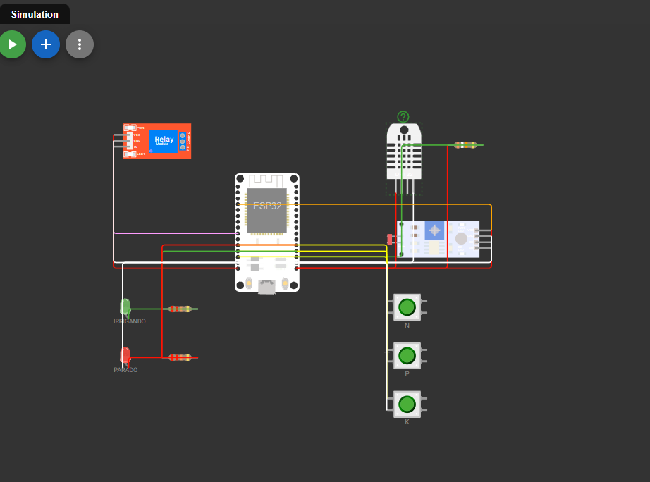

# 🌱 FarmTech Solutions — Sistema de Irrigação Inteligente (Fase 2)

**FIAP — Inteligência Artificial**  
**Aluno:** Kauan Maciel Forgiarini | **RM:** 574005
**Aluno:** Wagner Adriano De Souza Silva Junio | **RM:** RM569431
**Aluno:** Thiago Lucas da Costa Bessa | **RM:** RM570367
**Aluna:** Beatriz de Oliveira Ossola Ribeiro | **RM:** RM570190
**Aluno:** Willian Kauê Tobias do Carmo | **RM:** RM570038
---

## 📋 Sumário

1. [Visão Geral do Projeto](#1-visão-geral-do-projeto)
2. [Cultura Agrícola Escolhida — Soja](#2-cultura-agrícola-escolhida--soja)
3. [Componentes e Mapeamento de Pinos](#3-componentes-e-mapeamento-de-pinos)
4. [Diagrama do Circuito (Wokwi)](#4-diagrama-do-circuito-wokwi)
5. [Lógica de Irrigação](#5-lógica-de-irrigação)
6. [Código ESP32 — C/C++](#6-código-esp32--cc)
7. [Integração Python + OpenWeather API (Ir Além 1)](#7-integração-python--openweather-api-ir-além-1)
8. [Análise Estatística em R (Ir Além 2)](#8-análise-estatística-em-r-ir-além-2)
9. [Como Executar o Projeto](#9-como-executar-o-projeto)
10. [Estrutura de Pastas](#10-estrutura-de-pastas)
11. [Referências](#11-referências)
12. [Vídeo Demonstrativo](#12-vídeo-demonstrativo)

---

## 1. Visão Geral do Projeto

Este projeto implementa um **sistema de irrigação automatizado e inteligente** para a startup **FarmTech Solutions**, desenvolvido como parte da Fase 2 do PBL da FIAP.

O sistema utiliza um microcontrolador **ESP32** simulado na plataforma [Wokwi.com](https://wokwi.com), monitorando em tempo real:

- Níveis dos nutrientes **N (Nitrogênio)**, **P (Fósforo)** e **K (Potássio)** — via botões verdes
- **pH do solo** — simulado via sensor LDR
- **Umidade do solo** — simulado via sensor DHT22
- **Previsão meteorológica** — integrada via Python com a API OpenWeatherMap

Com base nesses dados, o sistema decide automaticamente quando acionar a **bomba d'água** (relé azul), otimizando o uso de recursos hídricos na lavoura.

---

## 2. Cultura Agrícola Escolhida — Soja

A soja foi escolhida por ser a principal cultura do Rio Grande do Sul e uma das mais importantes do agronegócio brasileiro.

### Necessidades ideais da soja

| Parâmetro | Faixa Ideal | Sensor no Circuito |
|-----------|------------|-------------------|
| pH do solo | 5,5 – 7,0 | LDR (analógico) |
| Umidade do solo | 60% – 80% | DHT22 |
| Nitrogênio (N) | 80–120 kg/ha | Botão verde (GPIO 12) |
| Fósforo (P) | 60–90 kg/ha | Botão verde (GPIO 14) |
| Potássio (K) | 80–100 kg/ha | Botão verde (GPIO 27) |

> **Referência:** Embrapa Soja — *Tecnologias de Produção de Soja* (2023)

---

## 3. Componentes e Mapeamento de Pinos

| Componente | Substituto no Wokwi | GPIO (ESP32) | Tipo de Sinal |
|-----------|--------------------|-----------|----|
| Sensor de N | Push button verde | GPIO 12 | Digital PULLUP |
| Sensor de P | Push button verde | GPIO 14 | Digital PULLUP |
| Sensor de K | Push button verde | GPIO 27 | Digital PULLUP |
| Sensor de pH | LDR (fotoresistor) | GPIO 34 | Analógico 0–4095 |
| Sensor de umidade | DHT22 | GPIO 15 | Digital 1-wire |
| Bomba d'água | Relé Azul | GPIO 26 | Digital Output |
| LED de status | LED + resistor 220Ω | GPIO 2 | Digital Output |

**Por que esses substitutos?**
- **Botões → NPK:** os nutrientes são booleanos — adequado (botão pressionado = `LOW`) ou ausente (solto = `HIGH`)
- **LDR → pH:** leitura 0–4095 mapeada para 0,0–14,0. Mais luz = ADC maior = pH mais alto
- **DHT22 → Umidade do solo:** o percentual de umidade relativa representa a capacidade de campo do solo

---

## 4. Diagrama do Circuito (Wokwi)

### Imagem do circuito completo



> O arquivo `esp32/diagram.json` pode ser importado diretamente no [Wokwi.com](https://wokwi.com) para replicar o circuito completo.

### Esquema de conexões

```
ESP32 DevKit V1
├── GPIO 12 ──── [BTN N Verde] ──── GND
├── GPIO 14 ──── [BTN P Verde] ──── GND
├── GPIO 27 ──── [BTN K Verde] ──── GND
├── GPIO 34 ──── [LDR – Saída Analógica]
│               [LDR VCC] ──── 3.3V
│               [LDR GND] ──── GND
├── GPIO 15 ──── [DHT22 DATA]
│               [DHT22 VCC] ──── 3.3V
│               [DHT22 GND] ──── GND
├── GPIO 26 ──── [Relé Azul IN]
│               [Relé VCC]  ──── 5V
│               [Relé GND]  ──── GND
└── GPIO 2  ──── [Resistor 220Ω] ──── [LED Azul] ──── GND
```

### Mapa de cores dos fios

| Cor | Conexão |
|-----|---------|
| 🟢 Verde | Botões NPK → GPIO 12, 14, 27 |
| 🟠 Laranja | LDR (pH) → GPIO 34 |
| 🟡 Amarelo | DHT22 (umidade) → GPIO 15 |
| 🔵 Azul | Relé (bomba) → GPIO 26 |
| 🟣 Roxo | LED status → GPIO 2 |
| 🔴 Vermelho | VCC (3.3V / 5V) |
| ⚫ Preto | GND |

---

## 5. Lógica de Irrigação

```
LIGAR BOMBA quando TODAS as condições forem verdadeiras:
  ✅ Chuva prevista   ≤  5 mm
  ✅ Umidade do solo  <  60 %
  ✅ pH               ∈  [5,5 ; 7,0]
  ✅ N = true  OU  K = true

DESLIGAR BOMBA se qualquer condição falhar:
  ❌ Chuva prevista > 5 mm   → economia de água
  ❌ Umidade ≥ 80 %          → solo saturado
  ❌ pH fora da faixa        → corrigir antes de irrigar
  ❌ N e K ausentes          → solo nutricionalmente pobre
```

### Fluxograma de decisão

```
              INÍCIO (ciclo 3s)
                    │
           ┌────────▼────────┐
           │ Chuva > 5mm?    │──── SIM ──→ BOMBA OFF ❌
           └────────┬────────┘
                 NÃO│
           ┌────────▼────────┐
           │ Umidade ≥ 80%?  │──── SIM ──→ BOMBA OFF ❌ (saturado)
           └────────┬────────┘
                 NÃO│
           ┌────────▼──────────┐
           │ pH ∈ [5,5 ; 7,0]? │── NÃO ──→ BOMBA OFF ❌ (alertar pH)
           └────────┬──────────┘
                 SIM│
           ┌────────▼────────┐
           │ Umidade < 60%?  │──── NÃO ──→ BOMBA OFF (aguarda)
           └────────┬────────┘
                 SIM│
           ┌────────▼────────┐
           │ N=true ou K=true│──── NÃO ──→ BOMBA OFF ❌ (sem nutrientes)
           └────────┬────────┘
                 SIM│
                    ▼
              BOMBA ON ✅ 💧
```

### Tabela de decisão

| Chuva | Umidade | pH | P ou K | Decisão |
|-------|---------|-----|--------|---------|
| Sim | qualquer | qualquer | qualquer | ❌ Não irrigar |
| Não | ≥ 80% | qualquer | qualquer | ❌ Solo saturado |
| Não | qualquer | < 5,5 ou > 7,0 | qualquer | ❌ Alertar pH |
| Não | < 60% | 5,5–7,0 | ausentes | ❌ Sem nutrientes |
| Não | < 60% | 5,5–7,0 | presente | ✅ **IRRIGAR** |
| Não | 60–79% | qualquer | qualquer | ❌ Umidade ok |

---

## 6. Código ESP32 — C/C++

Arquivo: [`esp32/farmtech_irrigacao.ino`](./esp32/farmtech_irrigacao.ino)

### Principais funções

| Função | Descrição |
|--------|-----------|
| `setup()` | Inicializa pinos, Serial (115200) e DHT22 |
| `loop()` | Ciclo de 3s: lê sensores → decide → aciona relé → loga |
| `ldrParaPH()` | Converte ADC 0–4095 do LDR para pH 0,0–14,0 |
| `deveIrrigar()` | Aplica as 5 regras de decisão, retorna `bool` |
| `lerSerial()` | Recebe previsão de chuva (mm) do Python via Serial |
| `exibirStatus()` | Loga dados no Monitor Serial em formato legível + CSV |

### Exemplo de saída no Monitor Serial

```
--------------------------------------------------
FarmTech Solutions | Kauan Maciel Forgiarini RM574005
Cultura: SOJA
--------------------------------------------------
NPK    → N: SIM  | P: NÃO  | K: SIM
pH     → 6.23  ✅ IDEAL PARA SOJA (5.5–7.0)
Umidade→ 52.0%  ⬇ Baixa
Temp.  → 27.5 °C
Chuva  → 0.0 mm (sem previsão)
BOMBA  → 💧 LIGADA — irrigando!
--------------------------------------------------
```

---

## 7. Integração Python + OpenWeather API (Ir Além 1)

Arquivo: [`python/farmtech_api.py`](./python/farmtech_api.py)

### Fluxo de dados

```
OpenWeather API (JSON)
        │
        ▼
  Python Script
        │  float "8.5\n" via Serial
        ▼
     ESP32
        │  suspende irrigação se > 5mm
        ▼
  Relé desliga
        │
        ▼
  historico_clima.csv → análise em R
```

### Funcionalidades

1. Consulta precipitação prevista (3h) na API OpenWeatherMap (plano gratuito — 60 calls/min)
2. Envia o valor ao ESP32 via `Serial.write()` — lido com `Serial.available()` + `Serial.readStringUntil('\n')`
3. **Fallback manual:** quando a porta Serial não está disponível (Wokwi gratuito), exibe o valor para colar no código C/C++
4. Salva histórico em CSV para alimentar a análise em R

### Como configurar

```python
# Em python/farmtech_api.py:
API_KEY = "sua_chave_aqui"   # https://openweathermap.org → My API Keys
CIDADE  = "Santa Maria,BR"
```

### Instalação

```bash
pip install requests pyserial
python python/farmtech_api.py
```

---

## 8. Análise Estatística em R (Ir Além 2)

Arquivo: [`r-analysis/farmtech_analise.R`](./r-analysis/farmtech_analise.R)

### Etapas da análise

1. Carrega `historico_clima.csv` gerado pelo Python (ou cria dados simulados com `set.seed(574005)`)
2. Engenharia de variáveis: cria coluna `irrigacao` com as mesmas regras do firmware
3. Estatísticas descritivas de todas as variáveis ambientais
4. Matriz de correlação de Pearson (`corrplot`)
5. **Regressão Logística:** `irrigacao ~ umidade_pct + chuva_3h_mm + temperatura_c`
6. Avalia acurácia, sensibilidade e especificidade do modelo
7. Decisão para leitura atual

### Gráficos gerados

| Arquivo | Conteúdo |
|---------|---------|
| `correlacao.png` | Mapa de calor de correlações |
| `umidade_temporal.png` | Série temporal + pontos de irrigação |
| `distribuicao_chuva.png` | Histograma da precipitação prevista |
| `probabilidade_irrigacao.png` | P(irrigar) estimada pelo modelo logístico |

### Instalação

```r
install.packages(c("ggplot2","corrplot","dplyr","readr","lubridate"))
Rscript r-analysis/farmtech_analise.R
```

---

## 9. Como Executar o Projeto

### Passo 1 — Circuito no Wokwi

1. Acesse [wokwi.com](https://wokwi.com) e crie um novo projeto ESP32
2. No editor de código, cole o conteúdo de `esp32/farmtech_irrigacao.ino`
3. No editor de diagrama, cole o conteúdo de `esp32/diagram.json`
4. Clique em ▶️ **Start Simulation**
5. Abra o **Monitor Serial** (115200 baud) para acompanhar as leituras

### Passo 2 — Testar sensores

| Ação no Wokwi | Efeito esperado |
|---------------|----------------|
| Pressionar BTN N ou BTN K | Nutrientes marcados como presentes |
| Ajustar slider do LDR | Muda leitura de pH (0,0–14,0) |
| Ajustar slider do DHT22 | Muda umidade (bomba liga abaixo de 60%) |
| Digitar `10.0` no Serial | Chuva 10mm → bomba desliga |
| Digitar `0.0` no Serial | Sem chuva → lógica retomada |

### Passo 3 — Script Python

```bash
pip install requests pyserial
python python/farmtech_api.py
```

### Passo 4 — Análise R

```bash
Rscript r-analysis/farmtech_analise.R
# Gráficos salvos em r-analysis/graficos/
```

---

## 10. Estrutura de Pastas

```
FarmTech---Fase-2/
│
├── README.md                          ← Este arquivo
│
├── docs/
│   └── images/
│       └── circuito_wokwi.png         ← Imagem do circuito (Wokwi)
│
├── esp32/
│   ├── farmtech_irrigacao.ino         ← Firmware C/C++ ESP32
│   └── diagram.json                   ← Circuito importável no Wokwi
│
├── python/
│   ├── farmtech_api.py                ← OpenWeather + Serial + CSV
│   └── requirements.txt               ← Dependências Python
│
└── r-analysis/
    ├── farmtech_analise.R             ← Análise estatística + regressão
    └── graficos/                      ← Gráficos gerados (PNG)
```

---

## 11. Referências

- EMBRAPA. *Tecnologias de Produção de Soja — Região Central do Brasil 2023*. Disponível em: <https://www.embrapa.br>
- CONAB. *12º Levantamento Safra de Grãos 2023/24*. Disponível em: <https://www.conab.gov.br>
- OpenWeatherMap API. Disponível em: <https://openweathermap.org/api>
- Wokwi ESP32 Simulator. Disponível em: <https://wokwi.com>
- ESP32 Arduino Reference. Disponível em: <https://docs.espressif.com>
- R Core Team. *R: A Language and Environment for Statistical Computing*. Vienna, 2024.
- FIAP. *Material de Aula — Inteligência Artificial, Fase 2*. 2025.

---

## 12. Vídeo Demonstrativo

> 🎥 **[Clique aqui para assistir no YouTube](https://youtube.com/watch?v=LINK_DO_VIDEO)**

O vídeo demonstra:
- Montagem e funcionamento do circuito no Wokwi
- Testes com os botões NPK, LDR e DHT22
- Lógica de decisão da bomba sendo acionada em tempo real
- Dashboard Python com integração da API OpenWeather
- Resultados da análise estatística em R

---

*Desenvolvido por **Kauan Maciel Forgiarini** — RM 574005 | FIAP IA — Fase 2 | 2025*
